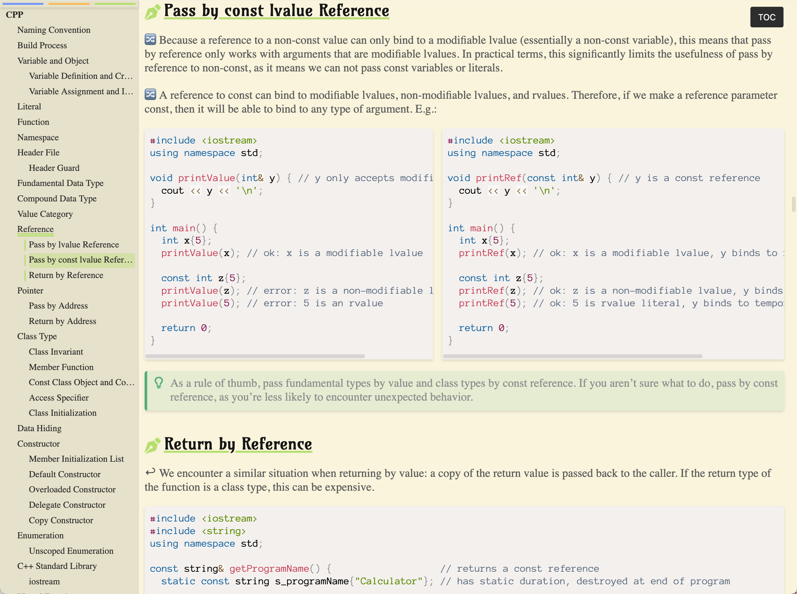
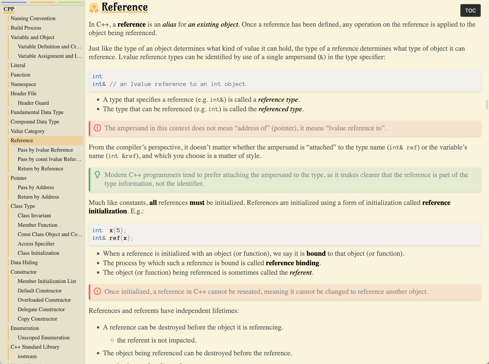

# XingJsdelivr

<div align="center">

[](https://opensource.org/licenses/MIT)
[](https://github.com/xingyuXXX/MarkdownSidebarTOC/commits/main)
[](https://makeapullrequest.com)

</div>

---

Personal CDN with JSdelivr.

## Pandoc

A css used for `pandoc` conversion from markdown to html.

```html
<link rel="stylesheet" href="https://cdn.jsdelivr.net/gh/xingyuXXX/XingJsdelivr@master/Pandoc/pandoc.css" />
```

## MarkdownSidebarTOC

Add a sidebar TOC to your HTML notes exported from markdown.

### Demo

<table>
  <tr>
    <td></td>
    <td></td>
  </tr>
</table>

### Usage

1. Add following to your markdown file:

   ```html
   <link rel="stylesheet" href="https://cdn.jsdelivr.net/gh/xingyuXXX/XingJsdelivr@master/MarkdownSidebarTOC/sidebar.css" />
   <script src="https://cdn.jsdelivr.net/gh/xingyuXXX/XingJsdelivr@master/MarkdownSidebarTOC/sidebar.js"></script>
   ```

2. Export markdown file to HTML.
